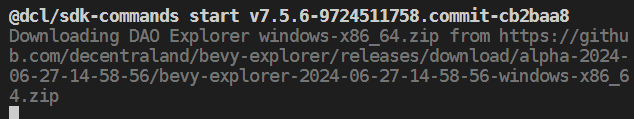

# Developing with Bevy Explorer

If you're new to scene creation, we highly recommend starting with the [Decentraland documentation](https://docs.decentraland.org/creator/development-guide/sdk7/installation-guide/#the-decentraland-editor). This will provide you with a solid foundation before diving into Bevy Explorer.

## Setting Up a Scene
To set up a scene with Bevy Explorer and enable experimental features, follow these steps:
1. **Navigate to Your Scene's Root Folder**: Open your terminal and navigate to the root folder of your scene.
2. **Install `protocol-squad` branch**: Run the following command to install the necessary packages from the protocol-squad branch:
    ```sh 
    npm install @dcl/sdk@protocol-squad @dcl/sdk-commands@protocol-squad --save-exact
    ```


## Running a Preview with Bevy Explorer
To preview your scene using Bevy Explorer:
1. **Start the Preview**: In your scene's root folder, run:
    ```sh 
        npm start
    ```
This will open Bevy Explorer with your scene running. Hot reloading is enabled, so any changes to the code or assets will automatically refresh the scene.

Note: the first time you run this in the scene, or if you delete the `node_modules` folder, the Bevy Explorer download takes place.




## Updating the SDK and Bevy Explorer Version
To update the SDK and Bevy Explorer to the latest version:
1. **Reinstall Packages**:
    Repeat the installation command from the "Setting Up a Scene" section:
    ```sh 
    npm install @dcl/sdk@protocol-squad @dcl/sdk-commands@protocol-squad --save-exact
    ```
    The SDK will update automatically if a new version of Bevy Explorer is required.


## Rolling Back to a Previous SDK Version

If you need to revert to the latest stable SDK version:

1. **Install Latest Stable Versions**: In your scene's root folder, run:
    ```sh 
    npm install @dcl/sdk@latest @dcl/sdk-commands@latest --save-exact
    ```
